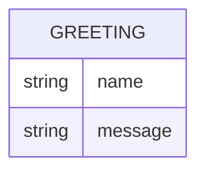

# Domain Model

Greeter has a single, non-persisted concept: the greeting it returns for a given name.

`Greeting` is never stored — it is computed per request from the `name` query parameter (or its default) and returned as the response body.